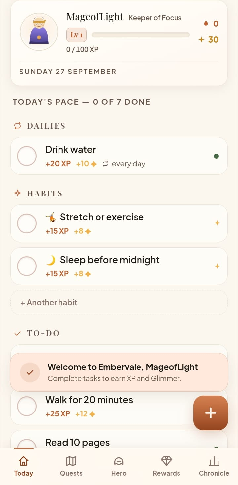
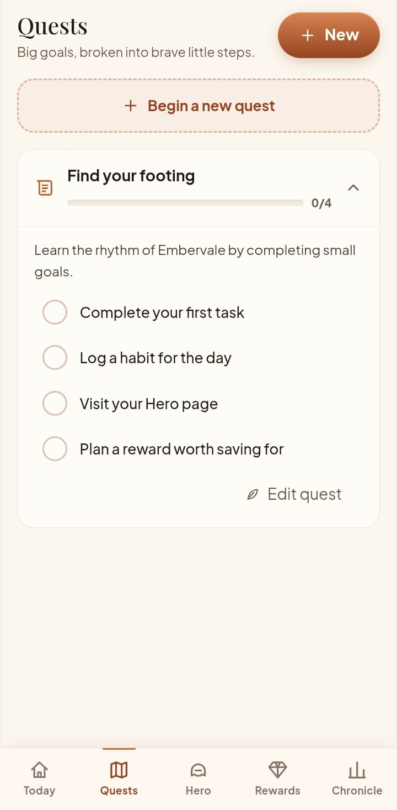
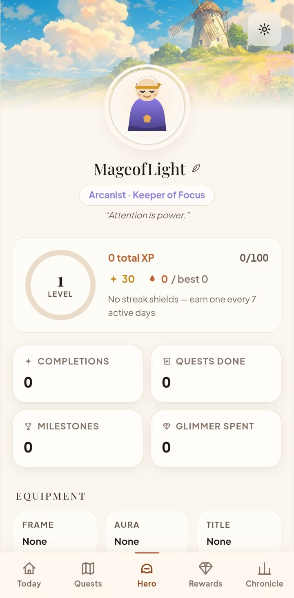
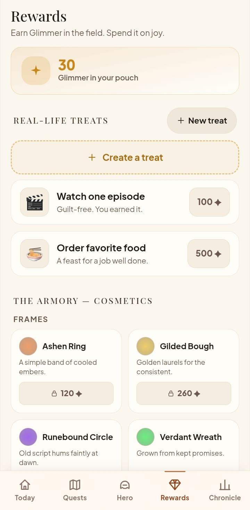
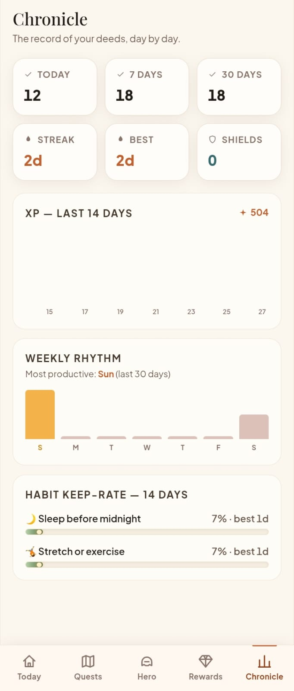

# Embervale — life, adventured

**A pocket RPG for real life.** Complete tasks, earn XP and Glimmer, keep your streak burning, conquer quests and level up your hero — all stored privately on your own device.

Embervale is a mobile-first, offline-first **Progressive Web App** built with **Next.js (App Router)**, **TypeScript**, **Tailwind CSS** and **IndexedDB**. No accounts, no server database, no tracking.

---

## Screenshots

| Today | Quests | Hero |Rewards | Chronicle |
|:-----:|:-------:|:----:|:-------:|:--------:|
|  |  |  |  | 


## The game loop

```
real-life task  →  complete it  →  +XP / +Glimmer  →  level up
        ↑                                              ↓
   streaks & shields  ←  daily rhythm  ←  spend Glimmer on rewards
```

- **Tasks** — one-time to-dos with priority (Calm / Steady / Urgent), optional due date & time.
- **Dailies** — recurring tasks (every day or specific weekdays).
- **Habits** — repeatable routines with their own streaks, best streak and 14-day keep-rate.
- **Quests** — bigger goals broken into milestones, each milestone and quest completion pays out.
- **Streaks** — a global streak for showing up daily, protected by **streak shields** (earned every 7 active days) that forgive missed days. Habits get grace days too. No guilt mechanics.
- **Achievements** — 18 deeds and honors, from *First Spark* to *Everburning*.
- **Rewards** — spend Glimmer on real-life treats you define (*"one episode → 100 ✦"*) and on cosmetics (frames, auras, titles) for your procedurally drawn hero.
- **Callings** — Vanguard, Arcanist, Pathstrider, Loreweaver, Emberwright. Cosmetic flavor, zero pay-to-win.

---

## Why IndexedDB instead of a database?

Embervale is **local-first by design**. Your to-do list is intimate data — it shouldn't live on someone else's server just to gamify your day.

| Concern | Server database | IndexedDB (Embervale) |
|---|---|---|
| Privacy | Data leaves your device | **Nothing ever leaves your device** |
| Accounts & login | Required | **None** |
| Offline | Broken | **Fully functional** |
| Latency | Network round-trips | **Instant, same-tick feedback** |
| Running cost | Hosting + DB bills | **Zero** |
| Works in a browser tab / installed PWA | Yes | **Yes** |

### Is it safe?

Yes — and in a very concrete sense:

- **No transmission, ever.** There is no API that receives your tasks. No analytics, no telemetry, no third-party trackers. The only network traffic is downloading the app itself (over HTTPS when hosted).
- **Origin-scoped storage.** IndexedDB is sandboxed per origin by the browser's same-origin policy — other websites cannot read Embervale's data.
- **No account, no breach surface.** There is no server-side store of user data to leak. Your data is as safe as your browser profile.
- **You own the bytes.** One tap in *Hero → Settings → Export data* downloads your entire game as a versioned JSON backup; *Import* restores it on any device.

The one honest trade-off of local-first: data lives in *that browser on that device*. Clearing site data removes it — which is exactly what the export/import backup is for, and why the Settings screen nudges you to keep a copy.

### Future cloud sync

The storage layer is an adapter: UI → services → repositories → `StorageAdapter`. Today the adapter is `IdbStorageAdapter`; a `SupabaseStorageAdapter` or `FirebaseStorageAdapter` can be plugged in later **without touching the UI**. (The `src/db/` folder left in the repo is dormant starter scaffolding — nothing imports it; delete it freely.)

---

## How to use Embervale

### First run

1. Open the app → three quick slides → **create your hero** (name, portrait shuffle, calling).
2. You start with light example content (editable/deletable): a few tasks, two habits, one starter quest and two treats.

### Everyday flow

- **Today** is your home screen: HUD with level, XP bar, streak (+shields) and Glimmer, then Dailies, Habits, Urgent and To-do. Tap the round button to complete — watch the sparks, `+XP +✦`, level-ups and deed unlocks.
- **`+` floating button** (or any dashed "create" row) opens a bottom sheet: name, type, priority, due date/time or weekdays. Two taps to add.
- Tap a row itself to **edit or delete** it.
- **Quests** — create a quest with milestones (one per line), tick milestones as you go; finishing pays a bonus.
- **Rewards** — redeem treats when you can afford them; buy/equip cosmetics in the Armory.
- **Hero** — your character sheet: level ring, totals, equipment, achievements, name/class editing, and **Settings**.
- **Chronicle** — game-styled stats: today/7d/30d completions, streaks, 14-day XP chart, weekly rhythm, habit keep-rates, quest progress.

### Install as an app (PWA)

- **Android/Chrome:** menu → *Add to Home screen* / *Install app*.
- **iOS/Safari:** Share → *Add to Home Screen*.
- Installed, it launches standalone (no browser chrome), works offline, and respects notches/safe areas.

### Backup & restore

*Hero → ⚙ Settings → Export data* downloads `embervale-backup-YYYY-MM-DD.json`. *Import* restores it. Keep a copy if you plan to clear browser data or switch devices.

---

## Getting started (development)

**Prerequisites:** Node.js 20.9+ (22 recommended — a `.nvmrc` is included).

```bash
npm install
npm run dev        # http://localhost:3000
```

**No environment variables are required.** The app is fully functional with zero configuration — see *Why IndexedDB*.

```bash
npm run build      # production build (works with or without .env)
npm run start      # serve the production build
npx vitest run     # game-logic test suite (progression, streaks, achievements)
```

---

## Deploying

The app is a standard Next.js site — any Next-capable host works, **no env vars needed**.


---

## Project structure

```
src/
  components/     UI kit, icons, avatar renderer, bottom nav shell, FX layer
  features/       today / quests / hero / rewards / stats / onboarding
  domain/         pure game logic (progression, streaks, achievements) + tests
  state/          zustand game store (orchestrates services & repositories)
  storage/        StorageAdapter interface → IndexedDB adapter → repositories
  services/       sound (WebAudio), snapshot builder
  config/         all tunable game/content/design data
  app/            Next.js routes (page, layout, manifest, health probe)
public/           icons, key art, service worker
scripts/          zero-dependency PWA icon generator
```

**Data model:** versioned IndexedDB schema (`embervale-db`, v1) with stores for tasks, habits, quests, rewards, log and a `kv` space for profile/settings/unlocks. Export format is versioned (`{ version, exportedAt, data }`) so future migrations can read old backups.

---

## Privacy & security checklist

- ✅ No accounts, no login, no personal data collected
- ✅ No task content ever sent to a server
- ✅ No analytics or third-party scripts
- ✅ Local storage only (IndexedDB + localStorage for tiny UI prefs)
- ✅ Cache API used solely for offline app assets, never for game state
- ✅ Versioned export/import for user-controlled backups

---

## License & credits

Built as an original product — branding, art direction, mechanics and code are its own. Inspired by the *concept* of gamified productivity, not by any specific app.
